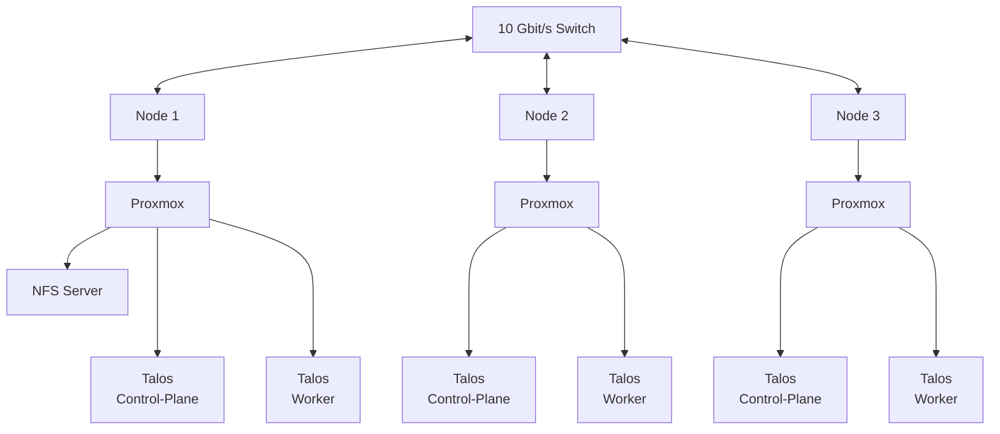

# Niklas Homelab

This project utilizes Infrastructure as Code and GitOps to automate the provisioning, operation, and updating of self-hosted services in my homelab.

## Features

- [x] Automated deployment of all services using [ArgoCD](https://argo-cd.readthedocs.io/en/stable/)
- [x] Automated updates of all services using [Renovate](https://github.com/renovatebot/renovate)
- [x] Automated DNS updates of local DNS (AdGuard Home) using [external-dns](https://github.com/kubernetes-sigs/external-dns)
- [x] Automated DNS updates of global DNS (Cloudflare) using [cert-manager.io](https://cert-manager.io/)
- [x] Automated certificate creation and renewal using [cert-manager.io](https://cert-manager.io/)
- [x] Automated backups using [restic](https://restic.net/)
- [ ] Media Server setup using [Plex](https://www.plex.tv/)
- [ ] Media Automation using Radarr, Sonarr, Lidarr
- [ ] Kubernetes Native Storage using [Rook.io](https://rook.io/)
- [ ] Automated Kubernetes backups using [velero](https://velero.io/)
- [ ] Automated Database Setup and Backups using [CloudNativePG](https://cloudnative-pg.io/)
- [ ] Monitoing setup using [Grafana](https://github.com/grafana/grafana), [Grafana Loki](https://github.com/grafana/loki), [Grafana Mimir](https://github.com/grafana/mimir) and [Grafana Alloy](https://github.com/grafana/alloy)

## Hardware Stack

The cluster consists of three nodes. Node 1 is the primary storage server that contains all spinning rust disks. Node 2 and 3 contain fast NVMe storage and fast networking for Rook.io/CephFS Storage.

The hardware was specifically selected to achieve a low-power C10 CPU state, resulting in a power draw of around **14 watts** for Node 2 and 3. Node 1, however, draws more power due to the HDDs.

