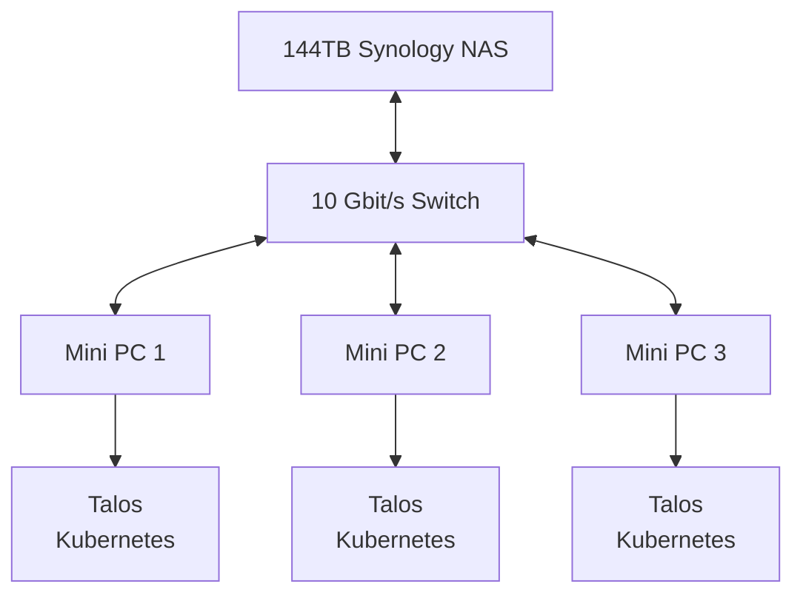

# GitOps Driven Homelab

> [!IMPORTANT]
> The project is currently in a transitional state from a single-node Debian server with k0s to a multi-node high-available setup using Talos and rook.io.

This project utilizes Infrastructure as Code and GitOps to automate the provisioning, operation, and updating of self-hosted services in my homelab.

## Features

- [x] Automated deployment of all services using [ArgoCD](https://argo-cd.readthedocs.io/en/stable/)
- [x] Automated updates of all services using [Renovate](https://github.com/renovatebot/renovate)
- [x] Automated DNS updates of local DNS (AdGuard Home) using [external-dns](https://github.com/kubernetes-sigs/external-dns)
- [x] Automated DNS updates of global DNS (Cloudflare) using [cert-manager.io](https://cert-manager.io/)
- [x] Automated certificate creation and renewal using [cert-manager.io](https://cert-manager.io/)
- [x] Automated backups using [restic](https://restic.net/)
- [x] Media Server setup using [Plex](https://www.plex.tv/)
- [x] Media Automation using Radarr, Sonarr, Lidarr
- [x] Password Management with Vaultwarden
- [ ] Kubernetes Native Storage using [Rook.io](https://rook.io/)
- [ ] Automated Kubernetes backups using [velero](https://velero.io/)
- [ ] Automated Database Setup and Backups using [CloudNativePG](https://cloudnative-pg.io/)
- [ ] Monitoing setup using [Grafana](https://github.com/grafana/grafana), [Grafana Loki](https://github.com/grafana/loki), [Grafana Mimir](https://github.com/grafana/mimir) and [Grafana Alloy](https://github.com/grafana/alloy)

## Hardware Stack

The cluster consists of three identical nodes. All low power mini PCs that contain fast NVMe storage and fast networking for Rook.io/CephFS storage.

The large storage on the spinning rust is on my Synology NAS which is available using NFS storage.

The hardware is not final yet since I'm waiting for the new Synology DS1825+ NAS to be available. I'm also not sure which Mini PC to buy since Zen 5 mobile looks fantastic, but there are no mini PCs available as of now.

