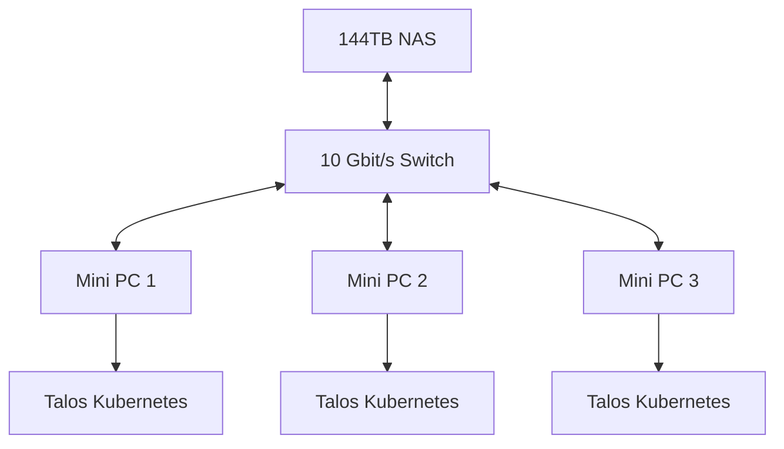

# GitOps Driven Homelab

> [!IMPORTANT]
> The project is currently in a transitional state from a single-node Debian server with k0s to a multi-node high-available setup using Talos and rook.io.

This project utilizes Infrastructure as Code and GitOps to automate the provisioning, operation, and updating of self-hosted services in my homelab.

## Features

- [x] Automated deployment of all services using [ArgoCD](https://argo-cd.readthedocs.io/en/stable/)
- [x] Automated updates of all services using [Renovate](https://github.com/renovatebot/renovate)
- [x] Automated DNS updates of local DNS (AdGuard Home) using [external-dns](https://github.com/kubernetes-sigs/external-dns)
- [x] Automated DNS updates of global DNS (Cloudflare) using [cert-manager.io](https://cert-manager.io/)
- [x] Automated certificate creation and renewal using [cert-manager.io](https://cert-manager.io/)
- [x] Automated backups using [restic](https://restic.net/)
- [x] Media Server setup using [Plex](https://www.plex.tv/)
- [x] Media Automation using Radarr, Sonarr, Lidarr
- [x] Password Management with Vaultwarden
- [ ] Kubernetes Native Storage using [Rook.io](https://rook.io/)
- [ ] Automated Kubernetes backups using [velero](https://velero.io/)
- [ ] Automated Database Setup and Backups using [CloudNativePG](https://cloudnative-pg.io/)
- [ ] Monitoing setup using [Grafana](https://github.com/grafana/grafana), [Grafana Loki](https://github.com/grafana/loki), [Grafana Mimir](https://github.com/grafana/mimir) and [Grafana Alloy](https://github.com/grafana/alloy)

## Hardware Stack

The hardware is still not final.
I'm waiting on a new 8 Bay NAS, probably the Synology DS1825+, that contains all spinning rust.
Additionally, I'm also waiting for new Zen 5 Mobile or Intel Lunar Lake Mobile Mini PCs which each have a 4 TB NVMe for Rook.io/CephFS.

